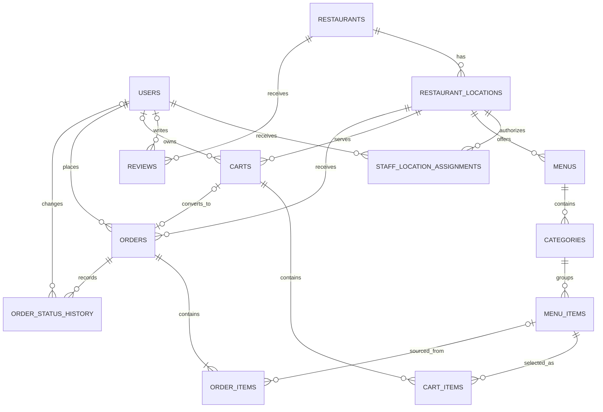

# Restaurant Discovery & Ordering App — Database Design

## Document Control

| Item | Detail |
| --- | --- |
| Document | Relational Database Design |
| Version | 1.0 |
| Status | MVP baseline |
| Database target | PostgreSQL 15 or later |
| Related documents | `01-project-charter.md`, `02-requirements-specification.md`, `03-acceptance-criteria.md` |

## 1. Database Overview

The design supports nearby restaurant discovery, rating and price comparison, restaurant menus, calorie disclosure, a one-restaurant cart, and atomic pickup-order submission. PostgreSQL is selected because it provides reliable transactions, constraints, JSON support, indexing, and an optional PostGIS extension for efficient geographic search.

The design follows these principles:

- Use UUID primary keys so identifiers are difficult to predict and safe across services.
- Store timestamps as `TIMESTAMPTZ` in UTC.
- Store money as exact `NUMERIC` values, never floating-point values.
- Store one three-letter ISO 4217 currency code with monetary records.
- Treat reviews as the rating source of truth and maintain cached aggregates on restaurants for fast sorting.
- Keep immutable item snapshots on orders so later menu edits do not change order history.
- Revalidate cart data before ordering and create an order in one database transaction.
- Store latitude and longitude in WGS 84; use PostGIS in production when available.
- Enforce basic ranges and relationships in the database and enforce cross-table business rules in the service transaction.

## 2. Design Assumptions

- No usable reference attachment was available for this baseline; requirements in `02-requirements-specification.md` are authoritative.
- One restaurant brand may have several physical locations.
- Menus belong to restaurant locations because price and availability can differ by location.
- The initial release uses one configured currency and supports pickup only.
- Customers may build an anonymous cart, but the cart must be linked to an authenticated customer before an order is submitted.
- A restaurant has price level 1–4. This is a comparison category, not an item price.
- Calorie values are non-negative whole kilocalories or NULL when not supplied.
- A full review-writing feature is outside the customer MVP, but the schema can store approved rating records required for display and sorting.
- Cached rating fields are updated in the same controlled transaction that publishes or removes a review.

## 3. Main Entities

| Entity | Purpose |
| --- | --- |
| `users` | Stores registered customers, restaurant staff, and authorized administrators. |
| `restaurants` | Stores restaurant-brand information, price level, and cached rating summary. |
| `restaurant_locations` | Stores searchable physical locations, coordinates, contact information, and operating hours. |
| `staff_location_assignments` | Restricts restaurant staff to assigned locations. |
| `menus` | Stores menus available at a restaurant location. |
| `categories` | Groups and orders menu items within a menu. |
| `menu_items` | Stores item description, price, calorie information, availability, and display order. |
| `reviews` | Stores valid rating records used to calculate restaurant rating aggregates. |
| `carts` | Stores an anonymous or customer cart for one restaurant location. |
| `cart_items` | Stores selected menu items, quantities, and the last quoted price. |
| `orders` | Stores order header, customer/contact snapshot, totals, status, and idempotency key. |
| `order_items` | Stores immutable item, price, calorie, currency, quantity, and line-total snapshots. |
| `order_status_history` | Records auditable order-status changes. |

## 4. Entity-Relationship Diagram



## 5. Table and Column Design

### 5.1 `users`

| Column | Type | Required | Key/default | Description |
| --- | --- | --- | --- | --- |
| `user_id` | UUID | Yes | PK | Internal user identifier. |
| `email` | VARCHAR(254) | Yes | Unique, case-insensitive index | Login/contact email. |
| `identity_subject` | VARCHAR(255) | No | Unique | Identifier from an external identity provider. |
| `password_hash` | TEXT | No | — | Salted adaptive hash when local authentication is used; never plaintext. |
| `display_name` | VARCHAR(100) | Yes | — | Customer or staff display name. |
| `phone` | VARCHAR(30) | No | — | Contact phone number. |
| `role` | VARCHAR(30) | Yes | `CUSTOMER` | Access role. |
| `status` | VARCHAR(20) | Yes | `ACTIVE` | Account state. |
| `email_verified_at` | TIMESTAMPTZ | No | — | Verification time. |
| `created_at`, `updated_at` | TIMESTAMPTZ | Yes | Current time | Audit timestamps. |

### 5.2 `restaurants`

| Column | Type | Required | Key/default | Description |
| --- | --- | --- | --- | --- |
| `restaurant_id` | UUID | Yes | PK | Restaurant-brand identifier. |
| `name` | VARCHAR(150) | Yes | — | Public restaurant name. |
| `description` | TEXT | No | — | Short description. |
| `price_level` | SMALLINT | Yes | Check 1–4 | Restaurant price category. |
| `average_rating` | NUMERIC(2,1) | Yes | `0.0` | Cached valid-review average. |
| `rating_count` | INTEGER | Yes | `0` | Cached valid-review count. |
| `is_active` | BOOLEAN | Yes | `TRUE` | Brand-level active state. |
| `created_at`, `updated_at` | TIMESTAMPTZ | Yes | Current time | Audit timestamps. |

### 5.3 `restaurant_locations`

| Column | Type | Required | Key/default | Description |
| --- | --- | --- | --- | --- |
| `location_id` | UUID | Yes | PK | Physical-location identifier. |
| `restaurant_id` | UUID | Yes | FK | Parent restaurant. |
| `location_name` | VARCHAR(120) | Yes | — | Branch/location label. |
| `address_line_1` | VARCHAR(200) | Yes | — | Primary address. |
| `address_line_2` | VARCHAR(200) | No | — | Additional address. |
| `city` | VARCHAR(100) | Yes | — | City. |
| `region` | VARCHAR(100) | No | — | State, province, or region. |
| `postal_code` | VARCHAR(20) | No | — | Postal code. |
| `country_code` | CHAR(2) | Yes | — | ISO 3166-1 alpha-2 code. |
| `latitude` | NUMERIC(9,6) | Yes | Check −90 to 90 | WGS 84 latitude. |
| `longitude` | NUMERIC(9,6) | Yes | Check −180 to 180 | WGS 84 longitude. |
| `phone` | VARCHAR(30) | No | — | Location contact number. |
| `timezone` | VARCHAR(64) | Yes | — | IANA timezone, for example `Asia/Bangkok`. |
| `operating_hours` | JSONB | No | — | Validated weekly schedule and exceptions. |
| `is_active` | BOOLEAN | Yes | `TRUE` | Search/order eligibility state. |
| `created_at`, `updated_at` | TIMESTAMPTZ | Yes | Current time | Audit timestamps. |

### 5.4 `staff_location_assignments`

| Column | Type | Required | Key/default | Description |
| --- | --- | --- | --- | --- |
| `user_id` | UUID | Yes | PK, FK | Authorized restaurant-staff user. |
| `location_id` | UUID | Yes | PK, FK | Assigned restaurant location. |
| `created_at` | TIMESTAMPTZ | Yes | Current time | Assignment time. |

### 5.5 `menus`

| Column | Type | Required | Key/default | Description |
| --- | --- | --- | --- | --- |
| `menu_id` | UUID | Yes | PK | Menu identifier. |
| `location_id` | UUID | Yes | FK | Restaurant location offering the menu. |
| `name` | VARCHAR(120) | Yes | — | Menu name. |
| `is_active` | BOOLEAN | Yes | `TRUE` | Customer visibility/order state. |
| `valid_from`, `valid_to` | DATE | No | — | Optional validity period. |
| `created_at`, `updated_at` | TIMESTAMPTZ | Yes | Current time | Audit timestamps. |

### 5.6 `categories`

| Column | Type | Required | Key/default | Description |
| --- | --- | --- | --- | --- |
| `category_id` | UUID | Yes | PK | Category identifier. |
| `menu_id` | UUID | Yes | FK | Parent menu. |
| `name` | VARCHAR(100) | Yes | — | Category name. |
| `display_order` | INTEGER | Yes | `0` | Ascending display position. |
| `is_active` | BOOLEAN | Yes | `TRUE` | Visibility state. |
| `created_at`, `updated_at` | TIMESTAMPTZ | Yes | Current time | Audit timestamps. |

### 5.7 `menu_items`

| Column | Type | Required | Key/default | Description |
| --- | --- | --- | --- | --- |
| `menu_item_id` | UUID | Yes | PK | Menu-item identifier. |
| `category_id` | UUID | Yes | FK | Parent category. |
| `name` | VARCHAR(150) | Yes | — | Item name. |
| `description` | TEXT | No | — | Item description. |
| `price` | NUMERIC(10,2) | Yes | Check ≥ 0 | Current item price. |
| `currency_code` | CHAR(3) | Yes | — | ISO 4217 currency. |
| `calories_kcal` | INTEGER | No | Check ≥ 0 | Supplied calories; NULL means not available. |
| `is_available` | BOOLEAN | Yes | `TRUE` | Current stock/order availability. |
| `is_active` | BOOLEAN | Yes | `TRUE` | Menu visibility state. |
| `display_order` | INTEGER | Yes | `0` | Ascending display position. |
| `created_at`, `updated_at` | TIMESTAMPTZ | Yes | Current time | Audit timestamps. |

### 5.8 `reviews`

| Column | Type | Required | Key/default | Description |
| --- | --- | --- | --- | --- |
| `review_id` | UUID | Yes | PK | Rating/review identifier. |
| `restaurant_id` | UUID | Yes | FK | Rated restaurant. |
| `user_id` | UUID | No | FK | Customer when rating is linked to an account. |
| `source` | VARCHAR(30) | Yes | `INTERNAL` | Approved rating source. |
| `external_reference` | VARCHAR(255) | No | — | Source-specific deduplication key. |
| `rating` | SMALLINT | Yes | Check 1–5 | Individual rating. |
| `status` | VARCHAR(20) | Yes | `PUBLISHED` | Publication/moderation state. |
| `created_at`, `updated_at` | TIMESTAMPTZ | Yes | Current time | Audit timestamps. |

### 5.9 `carts` and `cart_items`

| Table.column | Type | Required | Key/default | Description |
| --- | --- | --- | --- | --- |
| `carts.cart_id` | UUID | Yes | PK | Cart identifier. |
| `carts.user_id` | UUID | No | FK | Authenticated owner, when available. |
| `carts.session_key_hash` | VARCHAR(128) | No | Unique | Hash/reference for an anonymous session; never a raw session secret. |
| `carts.location_id` | UUID | Yes | FK | The cart's single restaurant location. |
| `carts.status` | VARCHAR(20) | Yes | `ACTIVE` | `ACTIVE`, `CONVERTED`, or `ABANDONED`. |
| `carts.currency_code` | CHAR(3) | Yes | — | Cart currency. |
| `carts.created_at`, `carts.updated_at` | TIMESTAMPTZ | Yes | Current time | Audit timestamps. |
| `cart_items.cart_item_id` | UUID | Yes | PK | Cart-line identifier. |
| `cart_items.cart_id` | UUID | Yes | FK | Parent cart. |
| `cart_items.menu_item_id` | UUID | Yes | FK | Selected item. |
| `cart_items.quantity` | SMALLINT | Yes | Check 1–99 | Selected quantity. |
| `cart_items.quoted_unit_price` | NUMERIC(10,2) | Yes | Check ≥ 0 | Last displayed price; revalidated at checkout. |
| `cart_items.quoted_at` | TIMESTAMPTZ | Yes | Current time | Price-quote time. |

### 5.10 `orders` and `order_items`

| Table.column | Type | Required | Key/default | Description |
| --- | --- | --- | --- | --- |
| `orders.order_id` | UUID | Yes | PK | Internal order identifier. |
| `orders.public_order_number` | VARCHAR(24) | Yes | Unique | Customer-facing order number. |
| `orders.user_id` | UUID | Yes | FK | Customer placing the order. |
| `orders.location_id` | UUID | Yes | FK | Receiving restaurant location. |
| `orders.converted_cart_id` | UUID | No | Unique FK | Source cart, when retained. |
| `orders.idempotency_key` | VARCHAR(100) | Yes | Unique per user | Duplicate-submission protection. |
| `orders.status` | VARCHAR(20) | Yes | `PENDING` | Current order status. |
| `orders.fulfillment_method` | VARCHAR(20) | Yes | `PICKUP` | MVP fulfillment method. |
| `orders.customer_name` | VARCHAR(100) | Yes | — | Order-time contact snapshot. |
| `orders.customer_phone` | VARCHAR(30) | Yes | — | Order-time phone snapshot. |
| `orders.customer_email` | VARCHAR(254) | No | — | Order-time email snapshot. |
| `orders.customer_notes` | VARCHAR(500) | No | — | Sanitized optional notes. |
| `orders.subtotal`, `orders.total` | NUMERIC(12,2) | Yes | Check ≥ 0 | Validated order totals. Equal in this MVP. |
| `orders.currency_code` | CHAR(3) | Yes | — | Order currency. |
| `orders.placed_at` | TIMESTAMPTZ | Yes | Current time | Submission time. |
| `orders.created_at`, `orders.updated_at` | TIMESTAMPTZ | Yes | Current time | Audit timestamps. |
| `order_items.order_item_id` | UUID | Yes | PK | Order-line identifier. |
| `order_items.order_id` | UUID | Yes | FK | Parent order. |
| `order_items.menu_item_id` | UUID | No | FK | Original item, if retained. |
| `order_items.item_name_snapshot` | VARCHAR(150) | Yes | — | Immutable item name. |
| `order_items.unit_price_snapshot` | NUMERIC(10,2) | Yes | Check ≥ 0 | Immutable unit price. |
| `order_items.currency_code` | CHAR(3) | Yes | — | Immutable currency. |
| `order_items.calories_kcal_snapshot` | INTEGER | No | Check ≥ 0 | Immutable supplied calories or NULL. |
| `order_items.quantity` | SMALLINT | Yes | Check 1–99 | Ordered quantity. |
| `order_items.line_total` | NUMERIC(12,2) | Yes | Generated | Unit price multiplied by quantity. |

### 5.11 `order_status_history`

| Column | Type | Required | Key/default | Description |
| --- | --- | --- | --- | --- |
| `order_status_history_id` | UUID | Yes | PK | History identifier. |
| `order_id` | UUID | Yes | FK | Related order. |
| `from_status` | VARCHAR(20) | No | — | Previous status; NULL for initial event. |
| `to_status` | VARCHAR(20) | Yes | — | New status. |
| `changed_by_user_id` | UUID | No | FK | Customer/staff/system actor when known. |
| `reason` | VARCHAR(255) | No | — | Sanitized operational reason. |
| `created_at` | TIMESTAMPTZ | Yes | Current time | Status-change time. |

## 6. SQL `CREATE TABLE` Statements

```sql
CREATE EXTENSION IF NOT EXISTS pgcrypto;

CREATE TABLE users (
    user_id UUID PRIMARY KEY DEFAULT gen_random_uuid(),
    email VARCHAR(254) NOT NULL,
    identity_subject VARCHAR(255) UNIQUE,
    password_hash TEXT,
    display_name VARCHAR(100) NOT NULL,
    phone VARCHAR(30),
    role VARCHAR(30) NOT NULL DEFAULT 'CUSTOMER'
        CHECK (role IN ('CUSTOMER', 'RESTAURANT_STAFF', 'DATA_ADMIN', 'SYSTEM_ADMIN')),
    status VARCHAR(20) NOT NULL DEFAULT 'ACTIVE'
        CHECK (status IN ('ACTIVE', 'SUSPENDED', 'DELETED')),
    email_verified_at TIMESTAMPTZ,
    created_at TIMESTAMPTZ NOT NULL DEFAULT CURRENT_TIMESTAMP,
    updated_at TIMESTAMPTZ NOT NULL DEFAULT CURRENT_TIMESTAMP,
    CHECK (length(btrim(email)) > 3),
    CHECK (password_hash IS NOT NULL OR identity_subject IS NOT NULL)
);

CREATE UNIQUE INDEX ux_users_email_lower ON users (lower(email));

CREATE TABLE restaurants (
    restaurant_id UUID PRIMARY KEY DEFAULT gen_random_uuid(),
    name VARCHAR(150) NOT NULL,
    description TEXT,
    price_level SMALLINT NOT NULL CHECK (price_level BETWEEN 1 AND 4),
    average_rating NUMERIC(2,1) NOT NULL DEFAULT 0.0
        CHECK (average_rating BETWEEN 0.0 AND 5.0),
    rating_count INTEGER NOT NULL DEFAULT 0 CHECK (rating_count >= 0),
    is_active BOOLEAN NOT NULL DEFAULT TRUE,
    created_at TIMESTAMPTZ NOT NULL DEFAULT CURRENT_TIMESTAMP,
    updated_at TIMESTAMPTZ NOT NULL DEFAULT CURRENT_TIMESTAMP,
    CHECK (
        (rating_count = 0 AND average_rating = 0.0)
        OR (rating_count > 0 AND average_rating BETWEEN 1.0 AND 5.0)
    )
);

CREATE TABLE restaurant_locations (
    location_id UUID PRIMARY KEY DEFAULT gen_random_uuid(),
    restaurant_id UUID NOT NULL REFERENCES restaurants(restaurant_id) ON DELETE RESTRICT,
    location_name VARCHAR(120) NOT NULL,
    address_line_1 VARCHAR(200) NOT NULL,
    address_line_2 VARCHAR(200),
    city VARCHAR(100) NOT NULL,
    region VARCHAR(100),
    postal_code VARCHAR(20),
    country_code CHAR(2) NOT NULL CHECK (country_code ~ '^[A-Z]{2}$'),
    latitude NUMERIC(9,6) NOT NULL CHECK (latitude BETWEEN -90 AND 90),
    longitude NUMERIC(9,6) NOT NULL CHECK (longitude BETWEEN -180 AND 180),
    phone VARCHAR(30),
    timezone VARCHAR(64) NOT NULL,
    operating_hours JSONB,
    is_active BOOLEAN NOT NULL DEFAULT TRUE,
    created_at TIMESTAMPTZ NOT NULL DEFAULT CURRENT_TIMESTAMP,
    updated_at TIMESTAMPTZ NOT NULL DEFAULT CURRENT_TIMESTAMP,
    UNIQUE (restaurant_id, location_name)
);

CREATE TABLE staff_location_assignments (
    user_id UUID NOT NULL REFERENCES users(user_id) ON DELETE RESTRICT,
    location_id UUID NOT NULL REFERENCES restaurant_locations(location_id) ON DELETE CASCADE,
    created_at TIMESTAMPTZ NOT NULL DEFAULT CURRENT_TIMESTAMP,
    PRIMARY KEY (user_id, location_id)
);

CREATE TABLE menus (
    menu_id UUID PRIMARY KEY DEFAULT gen_random_uuid(),
    location_id UUID NOT NULL REFERENCES restaurant_locations(location_id) ON DELETE RESTRICT,
    name VARCHAR(120) NOT NULL,
    is_active BOOLEAN NOT NULL DEFAULT TRUE,
    valid_from DATE,
    valid_to DATE,
    created_at TIMESTAMPTZ NOT NULL DEFAULT CURRENT_TIMESTAMP,
    updated_at TIMESTAMPTZ NOT NULL DEFAULT CURRENT_TIMESTAMP,
    CHECK (valid_to IS NULL OR valid_from IS NULL OR valid_to >= valid_from),
    UNIQUE (location_id, name)
);

CREATE TABLE categories (
    category_id UUID PRIMARY KEY DEFAULT gen_random_uuid(),
    menu_id UUID NOT NULL REFERENCES menus(menu_id) ON DELETE RESTRICT,
    name VARCHAR(100) NOT NULL,
    display_order INTEGER NOT NULL DEFAULT 0 CHECK (display_order >= 0),
    is_active BOOLEAN NOT NULL DEFAULT TRUE,
    created_at TIMESTAMPTZ NOT NULL DEFAULT CURRENT_TIMESTAMP,
    updated_at TIMESTAMPTZ NOT NULL DEFAULT CURRENT_TIMESTAMP,
    UNIQUE (menu_id, name)
);

CREATE TABLE menu_items (
    menu_item_id UUID PRIMARY KEY DEFAULT gen_random_uuid(),
    category_id UUID NOT NULL REFERENCES categories(category_id) ON DELETE RESTRICT,
    name VARCHAR(150) NOT NULL,
    description TEXT,
    price NUMERIC(10,2) NOT NULL CHECK (price >= 0),
    currency_code CHAR(3) NOT NULL CHECK (currency_code ~ '^[A-Z]{3}$'),
    calories_kcal INTEGER CHECK (calories_kcal >= 0),
    is_available BOOLEAN NOT NULL DEFAULT TRUE,
    is_active BOOLEAN NOT NULL DEFAULT TRUE,
    display_order INTEGER NOT NULL DEFAULT 0 CHECK (display_order >= 0),
    created_at TIMESTAMPTZ NOT NULL DEFAULT CURRENT_TIMESTAMP,
    updated_at TIMESTAMPTZ NOT NULL DEFAULT CURRENT_TIMESTAMP,
    UNIQUE (category_id, name)
);

CREATE TABLE reviews (
    review_id UUID PRIMARY KEY DEFAULT gen_random_uuid(),
    restaurant_id UUID NOT NULL REFERENCES restaurants(restaurant_id) ON DELETE RESTRICT,
    user_id UUID REFERENCES users(user_id) ON DELETE SET NULL,
    source VARCHAR(30) NOT NULL DEFAULT 'INTERNAL',
    external_reference VARCHAR(255),
    rating SMALLINT NOT NULL CHECK (rating BETWEEN 1 AND 5),
    status VARCHAR(20) NOT NULL DEFAULT 'PUBLISHED'
        CHECK (status IN ('PUBLISHED', 'HIDDEN', 'DELETED')),
    created_at TIMESTAMPTZ NOT NULL DEFAULT CURRENT_TIMESTAMP,
    updated_at TIMESTAMPTZ NOT NULL DEFAULT CURRENT_TIMESTAMP
);

CREATE UNIQUE INDEX ux_reviews_user_restaurant
    ON reviews (user_id, restaurant_id)
    WHERE user_id IS NOT NULL AND status <> 'DELETED';

CREATE UNIQUE INDEX ux_reviews_external_source
    ON reviews (source, external_reference)
    WHERE external_reference IS NOT NULL;

CREATE TABLE carts (
    cart_id UUID PRIMARY KEY DEFAULT gen_random_uuid(),
    user_id UUID REFERENCES users(user_id) ON DELETE RESTRICT,
    session_key_hash VARCHAR(128) UNIQUE,
    location_id UUID NOT NULL REFERENCES restaurant_locations(location_id) ON DELETE RESTRICT,
    status VARCHAR(20) NOT NULL DEFAULT 'ACTIVE'
        CHECK (status IN ('ACTIVE', 'CONVERTED', 'ABANDONED')),
    currency_code CHAR(3) NOT NULL CHECK (currency_code ~ '^[A-Z]{3}$'),
    created_at TIMESTAMPTZ NOT NULL DEFAULT CURRENT_TIMESTAMP,
    updated_at TIMESTAMPTZ NOT NULL DEFAULT CURRENT_TIMESTAMP,
    CHECK (user_id IS NOT NULL OR session_key_hash IS NOT NULL)
);

CREATE TABLE cart_items (
    cart_item_id UUID PRIMARY KEY DEFAULT gen_random_uuid(),
    cart_id UUID NOT NULL REFERENCES carts(cart_id) ON DELETE CASCADE,
    menu_item_id UUID NOT NULL REFERENCES menu_items(menu_item_id) ON DELETE RESTRICT,
    quantity SMALLINT NOT NULL CHECK (quantity BETWEEN 1 AND 99),
    quoted_unit_price NUMERIC(10,2) NOT NULL CHECK (quoted_unit_price >= 0),
    quoted_at TIMESTAMPTZ NOT NULL DEFAULT CURRENT_TIMESTAMP,
    UNIQUE (cart_id, menu_item_id)
);

CREATE TABLE orders (
    order_id UUID PRIMARY KEY DEFAULT gen_random_uuid(),
    public_order_number VARCHAR(24) NOT NULL UNIQUE,
    user_id UUID NOT NULL REFERENCES users(user_id) ON DELETE RESTRICT,
    location_id UUID NOT NULL REFERENCES restaurant_locations(location_id) ON DELETE RESTRICT,
    converted_cart_id UUID UNIQUE REFERENCES carts(cart_id) ON DELETE RESTRICT,
    idempotency_key VARCHAR(100) NOT NULL,
    status VARCHAR(20) NOT NULL DEFAULT 'PENDING'
        CHECK (status IN ('PENDING', 'CONFIRMED', 'PREPARING', 'READY', 'COMPLETED', 'CANCELLED')),
    fulfillment_method VARCHAR(20) NOT NULL DEFAULT 'PICKUP'
        CHECK (fulfillment_method = 'PICKUP'),
    customer_name VARCHAR(100) NOT NULL,
    customer_phone VARCHAR(30) NOT NULL,
    customer_email VARCHAR(254),
    customer_notes VARCHAR(500),
    subtotal NUMERIC(12,2) NOT NULL CHECK (subtotal >= 0),
    total NUMERIC(12,2) NOT NULL CHECK (total >= 0),
    currency_code CHAR(3) NOT NULL CHECK (currency_code ~ '^[A-Z]{3}$'),
    placed_at TIMESTAMPTZ NOT NULL DEFAULT CURRENT_TIMESTAMP,
    created_at TIMESTAMPTZ NOT NULL DEFAULT CURRENT_TIMESTAMP,
    updated_at TIMESTAMPTZ NOT NULL DEFAULT CURRENT_TIMESTAMP,
    UNIQUE (user_id, idempotency_key),
    CHECK (total = subtotal)
);

CREATE TABLE order_items (
    order_item_id UUID PRIMARY KEY DEFAULT gen_random_uuid(),
    order_id UUID NOT NULL REFERENCES orders(order_id) ON DELETE RESTRICT,
    menu_item_id UUID REFERENCES menu_items(menu_item_id) ON DELETE SET NULL,
    item_name_snapshot VARCHAR(150) NOT NULL,
    unit_price_snapshot NUMERIC(10,2) NOT NULL CHECK (unit_price_snapshot >= 0),
    currency_code CHAR(3) NOT NULL CHECK (currency_code ~ '^[A-Z]{3}$'),
    calories_kcal_snapshot INTEGER CHECK (calories_kcal_snapshot >= 0),
    quantity SMALLINT NOT NULL CHECK (quantity BETWEEN 1 AND 99),
    line_total NUMERIC(12,2)
        GENERATED ALWAYS AS (round(unit_price_snapshot * quantity, 2)) STORED,
    UNIQUE (order_id, menu_item_id)
);

CREATE TABLE order_status_history (
    order_status_history_id UUID PRIMARY KEY DEFAULT gen_random_uuid(),
    order_id UUID NOT NULL REFERENCES orders(order_id) ON DELETE RESTRICT,
    from_status VARCHAR(20),
    to_status VARCHAR(20) NOT NULL
        CHECK (to_status IN ('PENDING', 'CONFIRMED', 'PREPARING', 'READY', 'COMPLETED', 'CANCELLED')),
    changed_by_user_id UUID REFERENCES users(user_id) ON DELETE SET NULL,
    reason VARCHAR(255),
    created_at TIMESTAMPTZ NOT NULL DEFAULT CURRENT_TIMESTAMP
);
```

## 7. Recommended Indexes

```sql
-- Discovery, price filtering, and rating sorting
CREATE INDEX ix_restaurants_discovery
    ON restaurants (is_active, price_level, average_rating DESC, rating_count DESC);

CREATE INDEX ix_locations_restaurant_active
    ON restaurant_locations (restaurant_id, is_active);

-- Portable bounding-box prefilter; PostGIS is preferred for production scale.
CREATE INDEX ix_locations_lat_lon
    ON restaurant_locations (latitude, longitude)
    WHERE is_active = TRUE;

-- Active menu retrieval and configured display order
CREATE INDEX ix_menus_location_active
    ON menus (location_id, is_active);

CREATE INDEX ix_categories_menu_order
    ON categories (menu_id, is_active, display_order);

CREATE INDEX ix_menu_items_category_order
    ON menu_items (category_id, is_active, is_available, display_order);

-- Published rating calculation
CREATE INDEX ix_reviews_restaurant_published
    ON reviews (restaurant_id, rating)
    WHERE status = 'PUBLISHED';

-- Cart and order operations
CREATE INDEX ix_carts_user_status
    ON carts (user_id, status, updated_at DESC)
    WHERE user_id IS NOT NULL;

CREATE INDEX ix_orders_customer_recent
    ON orders (user_id, placed_at DESC);

CREATE INDEX ix_orders_location_queue
    ON orders (location_id, status, placed_at);

CREATE INDEX ix_order_status_history_order_time
    ON order_status_history (order_id, created_at);
```

### Optional PostGIS Index

For accurate, indexed radius search at production scale, enable PostGIS and add a generated geography point:

```sql
CREATE EXTENSION IF NOT EXISTS postgis;

ALTER TABLE restaurant_locations
ADD COLUMN geo GEOGRAPHY(POINT, 4326)
GENERATED ALWAYS AS (
    ST_SetSRID(ST_MakePoint(longitude, latitude), 4326)::geography
) STORED;

CREATE INDEX ix_locations_geo_active
    ON restaurant_locations USING GIST (geo)
    WHERE is_active = TRUE;
```

The service can then use `ST_DWithin(geo, search_point, radius_metres)` for eligibility and `ST_Distance` for distance. A restaurant exactly at the radius is included because `ST_DWithin` is inclusive.

## 8. Sample Records

The following example uses Thai baht (`THB`) only as sample data; the deployed currency remains configurable.

```sql
INSERT INTO users (
    user_id, email, identity_subject, display_name, phone, role
) VALUES (
    '10000000-0000-0000-0000-000000000001',
    'customer@example.com',
    'idp|sample-customer-001',
    'Sample Customer',
    '+66000000000',
    'CUSTOMER'
);

INSERT INTO restaurants (
    restaurant_id, name, description, price_level, average_rating, rating_count
) VALUES (
    '20000000-0000-0000-0000-000000000001',
    'Green Bowl Kitchen',
    'Fresh local meals and rice bowls.',
    2,
    5.0,
    1
);

INSERT INTO restaurant_locations (
    location_id, restaurant_id, location_name, address_line_1, city,
    country_code, latitude, longitude, phone, timezone, operating_hours
) VALUES (
    '30000000-0000-0000-0000-000000000001',
    '20000000-0000-0000-0000-000000000001',
    'Central Branch',
    '100 Sample Road',
    'Bangkok',
    'TH',
    13.756300,
    100.501800,
    '+66000000001',
    'Asia/Bangkok',
    '{"monday":{"open":"10:00","close":"21:00"}}'::jsonb
);

INSERT INTO menus (menu_id, location_id, name)
VALUES (
    '40000000-0000-0000-0000-000000000001',
    '30000000-0000-0000-0000-000000000001',
    'Main Menu'
);

INSERT INTO categories (category_id, menu_id, name, display_order)
VALUES (
    '50000000-0000-0000-0000-000000000001',
    '40000000-0000-0000-0000-000000000001',
    'Rice Bowls',
    1
);

INSERT INTO menu_items (
    menu_item_id, category_id, name, description, price, currency_code,
    calories_kcal, is_available, display_order
) VALUES
(
    '60000000-0000-0000-0000-000000000001',
    '50000000-0000-0000-0000-000000000001',
    'Grilled Chicken Rice Bowl',
    'Grilled chicken, vegetables, and rice.',
    120.00,
    'THB',
    450,
    TRUE,
    1
),
(
    '60000000-0000-0000-0000-000000000002',
    '50000000-0000-0000-0000-000000000001',
    'Seasonal Vegetable Bowl',
    'Seasonal vegetables and rice.',
    100.00,
    'THB',
    NULL,
    TRUE,
    2
);

INSERT INTO reviews (
    review_id, restaurant_id, user_id, source, rating
) VALUES (
    '70000000-0000-0000-0000-000000000001',
    '20000000-0000-0000-0000-000000000001',
    '10000000-0000-0000-0000-000000000001',
    'INTERNAL',
    5
);
```

### Example Order Snapshot

| Field | Sample value |
| --- | --- |
| Public order number | `RDO-20260902-0001` |
| Customer | `Sample Customer` |
| Restaurant location | `Green Bowl Kitchen — Central Branch` |
| Item | `Grilled Chicken Rice Bowl` |
| Quantity | `2` |
| Unit-price snapshot | `120.00 THB` |
| Calorie snapshot | `450 kcal` |
| Line total | `240.00 THB` |
| Status | `PENDING` |
| Fulfillment | `PICKUP` |

## 9. Core Query Examples

### 9.1 Nearby Search with PostGIS, Price Filter, and Rating Sort

```sql
WITH search AS (
    SELECT ST_SetSRID(ST_MakePoint(:longitude, :latitude), 4326)::geography AS point
)
SELECT
    r.restaurant_id,
    rl.location_id,
    r.name,
    rl.location_name,
    r.price_level,
    r.average_rating,
    r.rating_count,
    ST_Distance(rl.geo, search.point) / 1000.0 AS distance_km
FROM restaurants r
JOIN restaurant_locations rl ON rl.restaurant_id = r.restaurant_id
CROSS JOIN search
WHERE r.is_active = TRUE
  AND rl.is_active = TRUE
  AND r.price_level = ANY(:price_levels)
  AND ST_DWithin(rl.geo, search.point, :radius_metres)
ORDER BY
    (r.rating_count = 0) ASC,
    r.average_rating DESC,
    r.rating_count DESC,
    r.name ASC,
    rl.location_name ASC;
```

### 9.2 Active Menu with Calories

```sql
SELECT
    m.menu_id,
    c.category_id,
    c.name AS category_name,
    mi.menu_item_id,
    mi.name AS item_name,
    mi.description,
    mi.price,
    mi.currency_code,
    mi.calories_kcal,
    mi.is_available
FROM menus m
JOIN categories c ON c.menu_id = m.menu_id
JOIN menu_items mi ON mi.category_id = c.category_id
WHERE m.location_id = :location_id
  AND m.is_active = TRUE
  AND (m.valid_from IS NULL OR m.valid_from <= CURRENT_DATE)
  AND (m.valid_to IS NULL OR m.valid_to >= CURRENT_DATE)
  AND c.is_active = TRUE
  AND mi.is_active = TRUE
ORDER BY c.display_order, c.name, mi.display_order, mi.name;
```

## 10. Order-Creation Transaction

The service must perform the following steps in one transaction:

1. Begin the transaction and check `(user_id, idempotency_key)`.
2. If a matching order already exists, return that outcome without inserting another order.
3. Lock the active cart and selected menu-item rows needed for validation.
4. Verify that the customer, restaurant, location, menu, category, and every item are active.
5. Verify that each item is available, belongs to the cart's restaurant location, and uses the configured currency.
6. Compare current prices with quoted prices. If anything changed, roll back and return a review-required response.
7. Recalculate line totals and the order total on the server.
8. Insert one `orders` row, all `order_items` snapshots, and the initial `order_status_history` row.
9. Mark the source cart `CONVERTED`.
10. Commit and return the committed order. Never return success before commit.

Any failure before commit must roll back all order-related changes. The API must reconcile an uncertain network outcome by idempotency key before attempting another insert.

## 11. Business and Validation Rules

- API validation and database constraints must both reject invalid UUIDs, coordinates, rating values, price levels, quantities, prices, calorie values, currencies, and statuses.
- Restaurant discovery requires both `restaurants.is_active` and `restaurant_locations.is_active` to be true.
- Restaurant results exactly on the distance boundary are eligible.
- An unrated restaurant has `rating_count = 0` and cached `average_rating = 0.0`, but the UI displays **New / No ratings**.
- Only `PUBLISHED` reviews contribute to the rating aggregate.
- Cart item and menu item must resolve through category and menu to the cart's restaurant location. This cross-table rule is checked in the service transaction.
- All cart and order-item currencies must equal the cart/order currency.
- The server, not the client, calculates and validates final totals.
- An order must contain at least one order item. This is enforced inside the order transaction because a simple table check cannot validate related rows.
- The sum of `order_items.line_total` must equal `orders.subtotal` and `orders.total` for the MVP.
- Order status updates must follow the approved transition map and create a history row in the same transaction.
- Customer and administrative text is length-limited, normalized as appropriate, and safely encoded or sanitized at its output context.
- Hard deletion of referenced restaurant, menu, customer, or order records is avoided. Deactivation or approved anonymization preserves integrity and audit requirements.

## 12. Data Retention, Backup, and Audit

- Define order and customer retention periods with legal/privacy review before public launch.
- Do not retain a visitor's exact search coordinates after the search unless a separately approved and disclosed need exists.
- Retain operational audit events for the approved period and restrict access by role.
- Run encrypted database backups at least daily for the MVP.
- Test restore procedures against the recovery-point objective of 24 hours and recovery-time objective of 4 hours.
- Never write passwords, raw session keys, access tokens, or unnecessary exact coordinates to logs.
